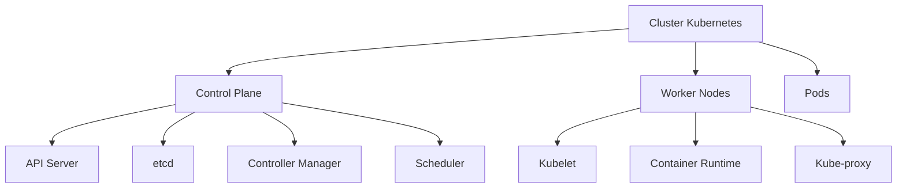
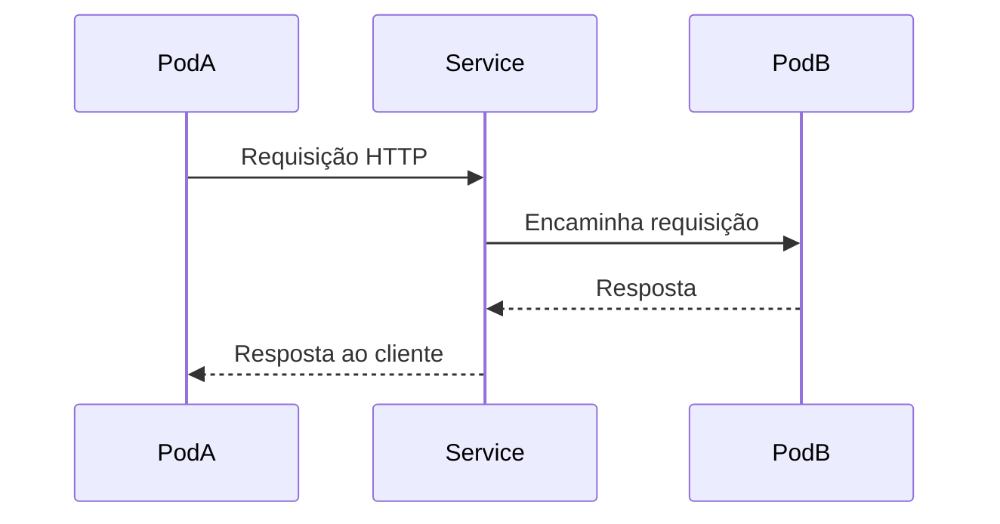
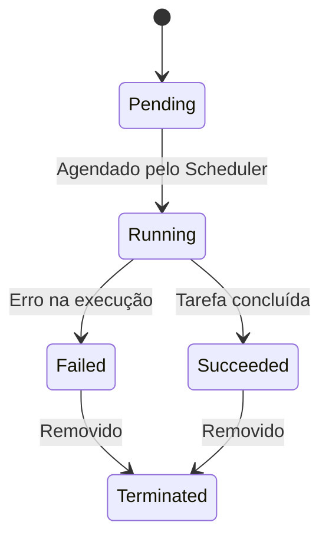
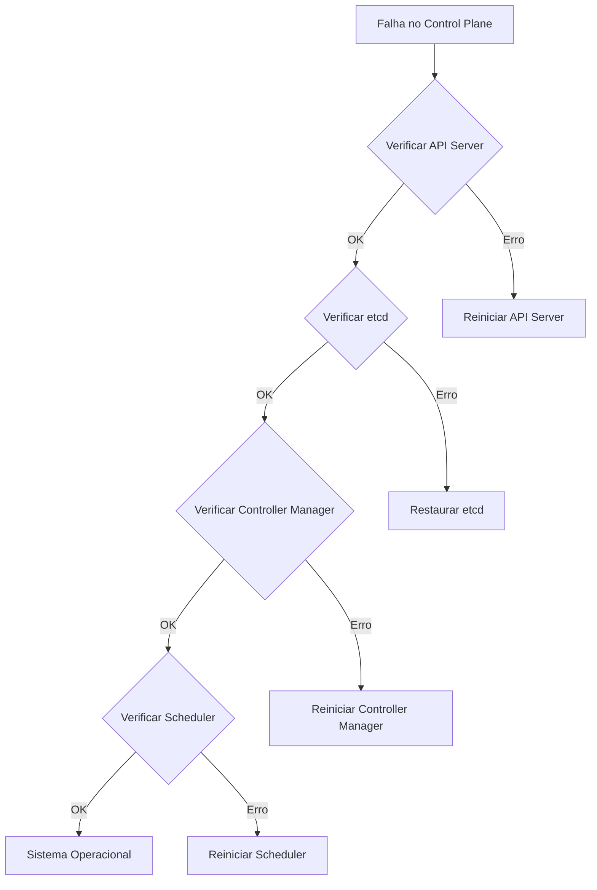
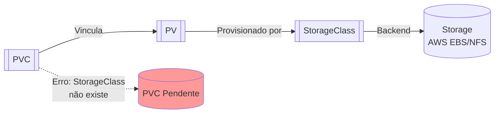
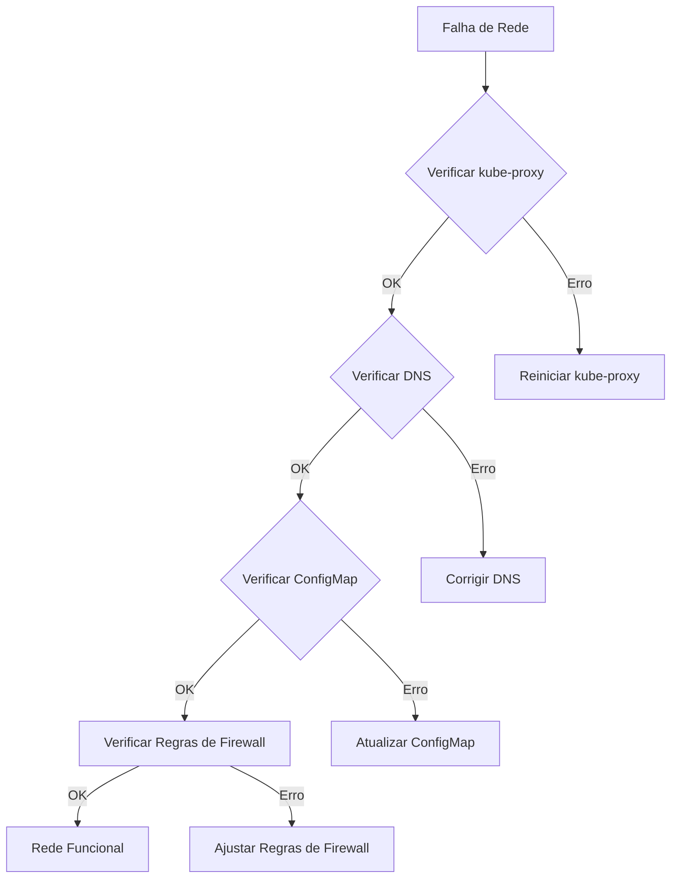
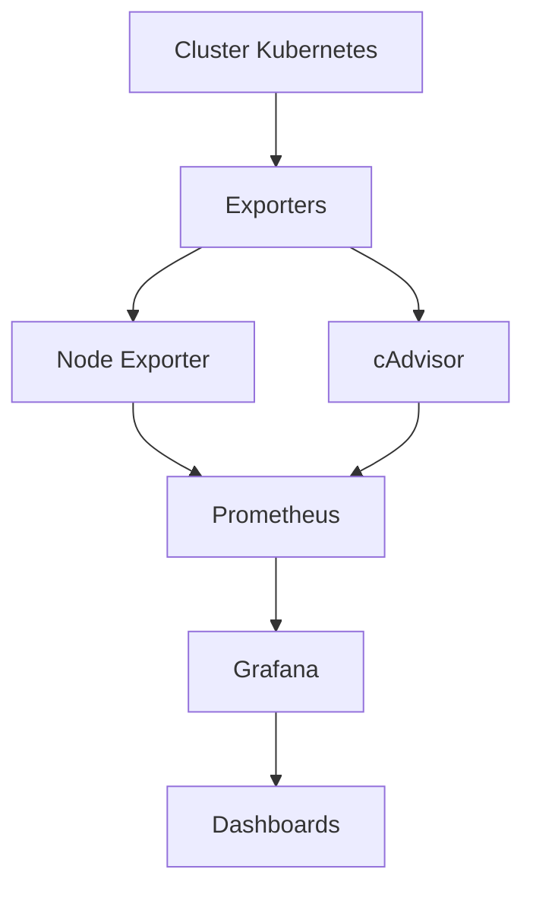
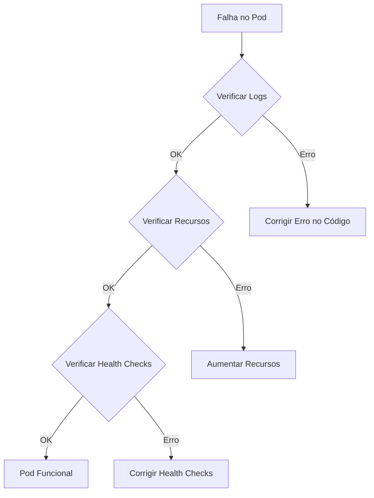

# Diagrama 1: Arquitetura do Kubernetes (Componentes Críticos)

Este diagrama mostra a arquitetura básica do Kubernetes, destacando os componentes críticos:
- **Cluster Kubernetes**: O conjunto completo de nós que compõem o cluster.
- **Control Plane**: O plano de controle que gerencia o cluster.
  - **API Server**: O ponto de entrada para todas as operações administrativas no cluster.
  - **etcd**: O armazenamento de dados chave-valor distribuído usado para armazenar todos os dados de cluster.
  - **Controller Manager**: Gerencia os controladores que regulam o estado do cluster.
  - **Scheduler**: Responsável por atribuir pods aos nós de trabalho.
- **Worker Nodes**: Os nós que executam as aplicações.
  - **Kubelet**: O agente que roda em cada nó de trabalho e garante que os contêineres estejam rodando.
  - **Container Runtime**: O software que executa os contêineres.
  - **Kube-proxy**: Mantém as regras de rede no nó de trabalho.
- **Pods**: As menores unidades de implantação no Kubernetes.

# Diagrama 2: Fluxo de Comunicação entre Pods e Services

Este diagrama mostra como a comunicação ocorre entre pods e serviços:
- **PodA** envia uma requisição HTTP para o **Service**.
- O **Service** encaminha a requisição para **PodB**.
- **PodB** responde ao **Service**.
- O **Service** responde ao **PodA**.

# Diagrama 3: Ciclo de Vida de um Pod

Este diagrama ilustra os diferentes estados pelos quais um pod pode passar:
- **Pending**: O pod foi aceito pelo sistema, mas ainda não foi agendado para um nó.
- **Running**: O pod foi agendado e está sendo executado.
- **Succeeded**: O pod completou sua tarefa com sucesso.
- **Failed**: O pod falhou na execução.
- **Terminated**: O pod foi removido.

# Diagrama 4: Troubleshooting de Falhas no Control Plane

Este diagrama mostra um fluxo de trabalho para solucionar problemas no plano de controle:
- **Falha no Control Plane** leva à verificação do **API Server**.
- Se o **API Server** estiver OK, verifica-se o **etcd**.
- Se o **etcd** estiver OK, verifica-se o **Controller Manager**.
- Se o **Controller Manager** estiver OK, verifica-se o **Scheduler**.
- Se todos os componentes estiverem OK, verifica-se o **Sistema Operacional**.

# Diagrama 5: Persistent Volumes (PV) e Persistent Volume Claims (PVC)

Este diagrama mostra a relação entre PVs, PVCs e StorageClasses:
- **PVC** vincula-se a um **PV**.
- **PV** é provisionado por uma **StorageClass**.
- **StorageClass** define o backend de armazenamento (por exemplo, AWS EBS, NFS).
- Se a **StorageClass** não existir, o **PVC** fica pendente.

# Diagrama 6: Troubleshooting de Rede (Exemplo Prático)

Este diagrama mostra um fluxo de trabalho para solucionar problemas de rede:
- **Falha de Rede** leva à verificação do **kube-proxy**.
- Se o **kube-proxy** estiver OK, verifica-se o **DNS**.
- Se o **DNS** estiver OK, verifica-se o **ConfigMap**.
- Se o **ConfigMap** estiver OK, verifica-se as **Regras de Firewall**.

# Diagrama 7: Monitoramento com Prometheus + Grafana

Este diagrama mostra a configuração de monitoramento com Prometheus e Grafana:
- **Cluster Kubernetes** envia dados para os **Exporters**.
- **Node Exporter** e **cAdvisor** coletam métricas.
- **Prometheus** coleta dados dos exporters.
- **Grafana** usa os dados do Prometheus para criar **Dashboards**.

# Diagrama Adicional: Troubleshooting de Pod (Exemplo)

Este diagrama mostra um fluxo de trabalho para solucionar problemas em um pod:
- **Falha no Pod** leva à verificação dos **Logs**.
- Se os **Logs** estiverem OK, verifica-se os **Recursos**.
- Se os **Recursos** estiverem OK, verifica-se os **Health Checks**.
- Se os **Health Checks** estiverem OK, o **Pod** está funcional.
